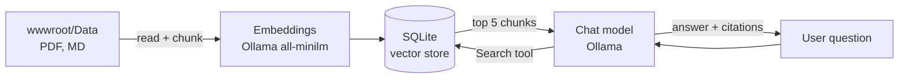

# RagSkill-Dotnet — a Claude Code skill for "chat with your documents" apps in .NET

[](https://github.com/vedats/RagSkill-Dotnet/actions/workflows/validate.yml)
[](LICENSE)

**[Türkçe](README.tr.md)**

The `dotnet-rag-chat` [Claude Code](https://claude.com/claude-code) skill builds a **working RAG (retrieval-augmented generation)
chat app** in .NET 10 Blazor Server — or adds one to your existing ASP.NET Core / Blazor project. Users upload
PDF/Markdown files and ask questions; answers come with clickable source citations.

Unlike guidance-only RAG skills, this one ships a **tested, runnable template** plus scripts, and a list of real
failures of this stack with their fixes, so Claude starts from code that already works.

```
You:    Create an app where our staff can ask questions about the HR policy PDFs. Use Ollama.
Claude: (uses dotnet-rag-chat) scaffolds HrPolicyChat, pulls the embedding model, builds, runs,
        asks a test question and checks the answer has a citation.
```

## Who is this for?

- **.NET developers** who want a "chat with your documents" app (internal knowledge base, product manuals,
  policies, contracts…) built on Blazor, or want to add one to an existing ASP.NET Core / Blazor project.
- **Teams that want data to stay local**: documents and embeddings never leave the machine; only the chat model
  can be a cloud model, and you can choose a local one instead.
- **Anyone debugging this stack** (Microsoft.Extensions.AI, DataIngestion, SqliteVec, OllamaSharp) — the pitfalls
  list covers the errors you're likely to hit.

**Not for you if** you work in Python or JavaScript (the skill only generates C#/Blazor and won't trigger for other
stacks — look at LangChain/LlamaIndex-based skills instead), or you need a hosted multi-user product out of the box
(see [AnythingLLM](https://github.com/Mintplex-Labs/anything-llm)).

| Where it runs | Works? |
|---|---|
| Claude Code (terminal, desktop app, IDE extensions) on Windows, macOS or Linux | ✅ It runs Python, `dotnet` and Ollama on your machine |
| claude.ai / Claude chat apps | ⚠️ Advice only — that sandbox can't run `dotnet` or reach your local Ollama |
| Other agents that read `SKILL.md` | ❓ Untested |

What you need: Claude Code and Python for the skill itself; the .NET 10 SDK and a running Ollama for the app it
builds (see [Requirements](#requirements)).

## Features of the generated app

- 📄 **Documents page** — upload (PDF, Markdown; size/count limits, per-file status) and delete with confirmation
- 💬 **Chat with citations** — answers cite the source file and quote; clicking opens the PDF/Markdown viewer at the quote
- ⚡ **Fast restarts** — incremental indexing: only new/changed files are embedded (manifest), deleted files are removed from the index, indexing starts in the background at startup
- 🧠 **Memory** — conversation saved per browser and restored after navigation, reload or restart; only the last N messages are sent to the model
- 🛡️ **Robust** — retries for flaky embedding calls, a clear banner instead of a crash when Ollama is down, failed documents re-indexed automatically once Ollama is back
- 🔌 **Local-first** — embeddings run locally (`all-minilm`); chat via Ollama, cloud (`gpt-oss:120b-cloud`) or local models

## Stack

| Part | Default |
|---|---|
| UI | .NET 10 Blazor Server |
| AI abstractions | Microsoft.Extensions.AI |
| Chat model | Ollama — `gpt-oss:120b-cloud` (any Ollama model with tool support) |
| Embeddings | Ollama — `all-minilm` (384 dimensions, local) |
| Ingestion | Microsoft.Extensions.DataIngestion (semantic chunking, PdfPig, Markdig) |
| Vector store | SQLite + sqlite-vec (`CommunityToolkit.VectorData.SqliteVec`) |



## Requirements

- [Claude Code](https://claude.com/claude-code)
- [.NET 10 SDK](https://dotnet.microsoft.com/download)
- Python 3.9+ (for the scripts)
- [Ollama](https://ollama.com) running locally; for `*-cloud` chat models, the Ollama app signed in

## Install

**As a plugin (recommended):**

```bash
claude plugin marketplace add vedats/RagSkill-Dotnet
claude plugin install dotnet-rag-chat@dotnet-rag-chat
```

(or inside Claude Code: `/plugin marketplace add vedats/RagSkill-Dotnet`, then `/plugin install dotnet-rag-chat@dotnet-rag-chat`)

**Manually:** copy `skills/dotnet-rag-chat/` to `~/.claude/skills/dotnet-rag-chat/` (all projects) or to
`<project>/.claude/skills/dotnet-rag-chat/` (one project).

## Use

Just describe what you want — the skill triggers on requests about RAG / document Q&A / "chat with my PDFs" in .NET:

- *"Create a Blazor app to chat with our product manuals (PDF) using Ollama."*
- *"Add document Q&A with citations to my existing ASP.NET Core app in ./ShopAdmin."*
- *"My RAG app re-indexes all PDFs on every restart and the first question takes minutes."*

You can also run the scripts without Claude:

```bash
# new app
python skills/dotnet-rag-chat/scripts/scaffold.py MyDocsChat --output ./MyDocsChat
cd MyDocsChat && ollama pull all-minilm && dotnet run

# add to an existing project (then follow references/integrate-existing.md for Program.cs / App.razor)
python skills/dotnet-rag-chat/scripts/integrate.py ./ShopAdmin
```

`scaffold.py` options: `--chat-model`, `--embedding-model`, `--embedding-dimensions`, `--max-tokens-per-chunk`, `--no-examples`.
Both scripts refuse to overwrite existing files.

## Repository layout

```
.claude-plugin/          plugin + marketplace manifests
skills/dotnet-rag-chat/
  SKILL.md               instructions Claude follows
  scripts/scaffold.py    new app from the template
  scripts/integrate.py   copy the chat into an existing project
  references/            architecture, pitfalls (11 known failures), integration guide
  assets/template/       the runnable app (project name "RagChatTemplate")
.github/workflows/       CI: scaffold + build, integrate into `dotnet new blazor` + build
```

## Known pitfalls it handles

Distilled from real debugging (details in [`pitfalls.md`](skills/dotnet-rag-chat/references/pitfalls.md)):
Guid/string key mismatch in the vector collection · nullable tool parameters breaking OllamaSharp's schema parsing ·
duplicate chunks on re-ingestion · chunks larger than the embedding model's 256-token window · transient Ollama
embedding failures · full re-index on every start · circuit crash when Ollama is down · lost chat history ·
orphaned tool results when trimming history · failed documents never retried.

## Limitations

- No authentication in the generated app — anyone who can reach it can upload/delete documents. Add auth before exposing it.
- Three dependencies are previews (`CommunityToolkit.VectorData.SqliteVec`, `Microsoft.Extensions.DataIngestion*`); pin versions.
- Ollama only out of the box; other providers need a code change in `Program.cs` (see `references/architecture.md`).

## Contributing

Issues and PRs are welcome. Please keep the template runnable: CI scaffolds a project, integrates into a fresh
`dotnet new blazor` app and builds both. If you fix a new failure mode, add it to `references/pitfalls.md` with
the symptom text people will actually see.

## License

[MIT](LICENSE). Bundled third-party code keeps its own license — see [THIRD-PARTY-NOTICES.md](THIRD-PARTY-NOTICES.md).
